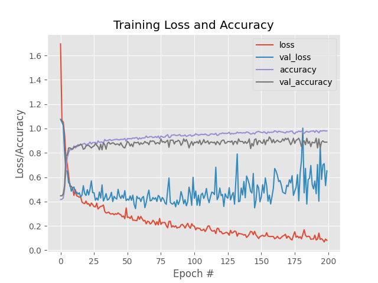
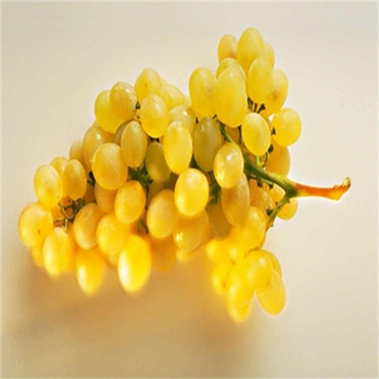
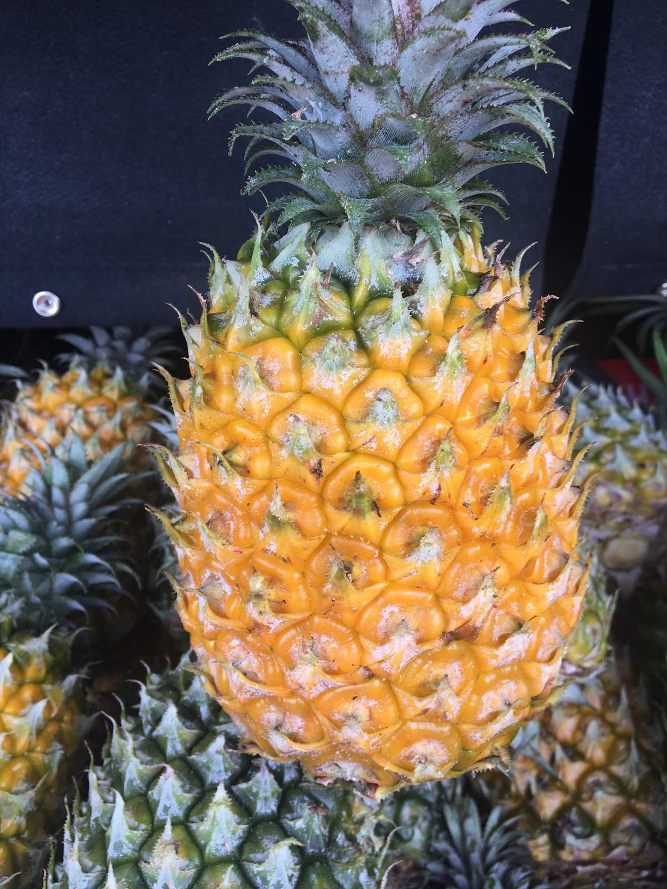
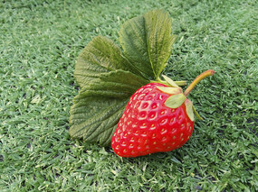

# Keras_Cnn_image_classification_identification

Keras uses convolutional networks for image classification and recognition.

## Dependent

- python3.9

## Prepare Data

- download your data to the dataset directory ./dataset
- three types of fruit classification data have been provided

## Use

- Start training data

> python train.py

- Identifying Images

> python identify.py

## Record

- Training record

> - training set accuracy 98% verification set accuracy 88%
>
> 

- Identification record

<figure>  
    
  <figcaption>result: {'identify_label': 'grape', 'identify_rate': '99.39%', 'prediction': {'grape': '99.39%', 'pineapple': '0.49%', 'strawberry': '0.12%'}}</figcaption>  
</figure>
<figure>  
    
  <figcaption>result: {'identify_label': 'pineapple', 'identify_rate': '94.44%', 'prediction': {'grape': '5.04%', 'pineapple': '94.44%', 'strawberry': '0.52%'}}</figcaption>  
</figure>
<figure>  
    
  <figcaption>result: {'identify_label': 'strawberry', 'identify_rate': '99.99%', 'prediction': {'grape': '0.01%', 'pineapple': '0.0%', 'strawberry': '99.99%'}}</figcaption>  
</figure>

# About

- Keras

> Keras is a simple, modular, and extensible deep learning framework for Python. It supports various tasks, including
> image classification, speech recognition, and natural language processing.

- CNN

> Convolutional Neural Network (CNN) is an efficient recognition method developed from the variation of Multi-Layer
> Perceptron, originated from the early research on cat visual cortex by biological scientists Hubel and Wiesel. CNN
> adopts local connection and weight sharing to reduce the number of weights, lower model complexity, and avoid complex
> feature extraction and data reconstruction in traditional recognition algorithms. In dealing with two-dimensional
> image
> problems, CNN can self-extract image features including color, texture, shape, and topological structure of the image,
> exhibiting robustness and computational efficiency.